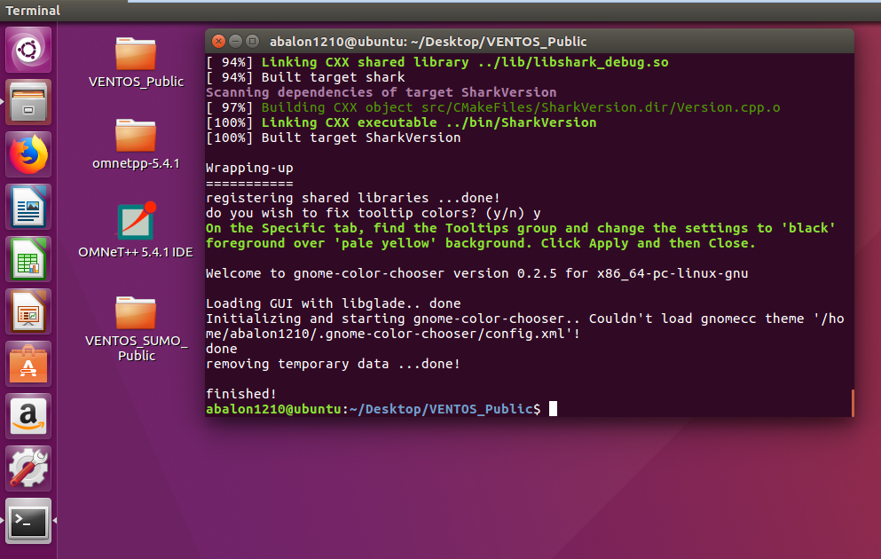
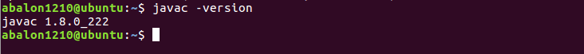
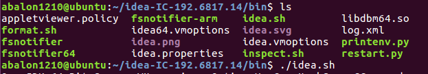
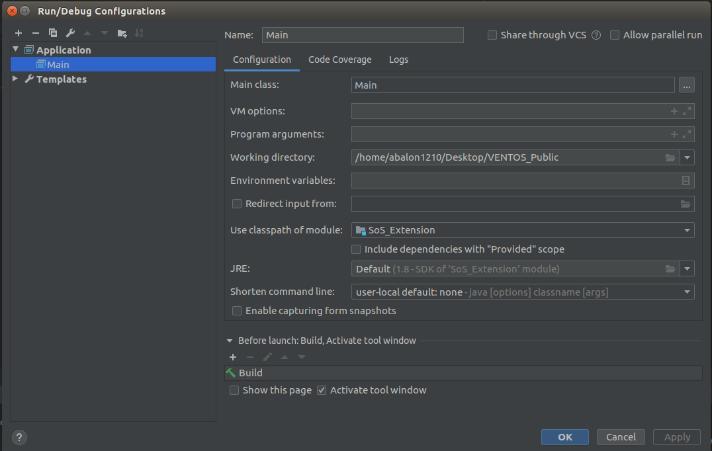

# Statistical Verification Framework of Platooning SoS

The framework is to effectively verify the existing Platooning management system, VENTOS for the case study of applying fault localization and diagnosis technique on the CPS. The remaining part contains 1) Installation of the StarPlateS framework (ver. OCT 2019).

## Installation

The first step to use the StarPlateS is installing the VENTOS framework on your device. Because the VENTOS is optimized on the Ubuntu 16.04 64bit, MAC Sierra(10.12), Elcapitan(10.11), and Yosemite(10.10), we strongly recommend you to use one of the OS versions. 
The following installation steps are based on the Ubuntu 16.04 64bit.

### Installing the VENTOS framework

#### 1. Download the git
<pre><code> sudo apt-get install git </code></pre>

#### 2. Clone the VENTOS_Public repository

We downloaded the repository at Desktop to follow the same configuration in the VENTOS manual.
<pre><code> cd ~/Desktop
 git clone https://github.com/ManiAm/VENTOS_Public
</code></pre>

#### 3. Execute runme script in the VENTOS_Public folder.

You should not execute the "runme" script as sudo/root. 
It may take 1~2 hour to check and install the essential libraries. 
<pre><code> cd VENTOS_Public
 ./runme
</code></pre>
There could be an error with downloading "omnetpp-5.4.1-src-linux-tgz" file. In that case, you can download the file at [OMNETT++5.4.1](https://omnetpp.org/download/old.html), and extract it at Desktop. After that, you can execute "runme" successfully. 
If you get any other error messages when installing libraries, please refer the [VENTOS Issues](https://github.com/ManiAm/VENTOS_Public/issues) to solve the error. 

If you got the message "finished!" with the following folders and file set at Desktop, the VENTOS installation is finished. 

#### 4. Edit OMNET++ desktop shortcut

To change the OMNET++ shortcut setting, open the shortcut file.
<pre><code> cd ~/Desktop 
 gedit ./opensim-ide.desktop
</code></pre>

Then, replace the line starting with 'Exec' to the following line:
<pre><code> Exec=bash -i -c '/home/yourid/Desktop/omnetpp-5.4.1/bin/omnetpp;$SHELL'
</code></pre>

#### 5. Run OMNeT++ 5.4.1 IDE and Select Desktop as workspace 

You don't also need to download the INET framework and OMNET++ programming examples. 

#### 6. Import VENTOS on the OMNET++
- Click "File"-> "Import" 
- Choose "General"-> "Existing Projects into Workspace" and click "Next" button
- Select *VENTOS_Public* folder as root directory and click "Finish"
 - (Unselect the "Coply projects into workspace" if the VENTOS folder is already in your workspace.)

#### 7. Run the VENTOS
- Click "Run Configurations" which is just next to the "Run" button
- Choose *OMNET++ Simulation* and generate new configuration
- Set "Working dir" to */VENTOS/examples/platoon_cacc*
- Choose *omnetpp.ini* in "ini file(s)" and *CACCVehicleStream1* in "Config name"
- Click "Apply" and "Run"

If it runs with SUMO gui, there would be no problem on installing the VENTOS framework. If there is any error, please check whether you thoroughly follow the above steps.

### Installing the StarPlateS framework

#### 1. Clone the github
<pre><code> git clone https://github.com/abalon1210/StarPlateS </code></pre>

#### 2. Copy and paste the StarPlateS files into VENTOS_Public
Copy all files of the StarPlateS and paste them into VENTOS_Public folders with merging and replacing option.

#### 3. Install Intellij IDE
As you know there are various kinds of tools that make you convenient in developing code. We select the Intellij IDE as our default IDE, because 1) our framework is an wrap-up software of VENTOS using Java, 2) we use abstract verification module from SIMVA-SoS framework which is implemented in Java. We think that there is no problem on using other tools, such as Eclipse, Vim, etc.

#### 4. Install Java jdk
When installing the VENTOS_Public, java 8 is installed, but it is not jdk, but jre. To use StarPlateS, you need to download Java jdk 8. 
<pre><code> sudo apt-get install openjdk-8-jdk 
 javac -version
</code></pre>

If you get the above message, jdk 1.8 is successfully installed in your Ubuntu.

#### 5. Run Intellij with console
When opening the Intellij IDE, please open it by console, not use shotcut icon on the menu. Please refer the following figure.

If you get SDK error in Intellij, please execute the following steps 
- Click "File" -> "Project Structure" -> "SDKs" in Platform Settings
- Add new JDK at */usr/lib/jvm/java-8-openjdk-amd64*, which is a common location of the jdk.
- Click "Project" in Project Settings and set your SDK to java 1.8

#### 6. Run the StarPlateS 
- Click "File" -> "Open" -> *VENTOS_Public*
- Go to "Project Structure", click "Import Module", and add *SoS_Extension*
- Click "Add Configuration" and add "Application" like the following figure

- Click "Run", then it will be executed.

You can check the execution logs at "VENTOS_Public/examples/platoon_SoS/results".

If you get an "Invalid java release error", please change Project language level to 8, which is in "Project Structure" -> "Project".

#### 7. Git setting
If you have any problem on repository confliciting between this and ManiAm/VENTOS_Public, please change your origin url to this repository. 

In Intellij console, 
- Check the current origin url
<pre><code> git remote -v </code></pre>

- Change the url to this repository
<pre><code> git remote set-url origin https://github.com/abalon1210/StarPlateS.git </code></pre>

- Check the current origin url again
<pre><code> git remote -v </code></pre>

### Executing StarPlateS framework with localization module
Prerequisites
- Import GraphStream libraries, which are in the [SoS_Extension/lib] folder.

## Reference
1. https://maniam.github.io/VENTOS/
2. https://github.com/SESoS/SIMVA-SoS
3. http://graphstream-project.org/
